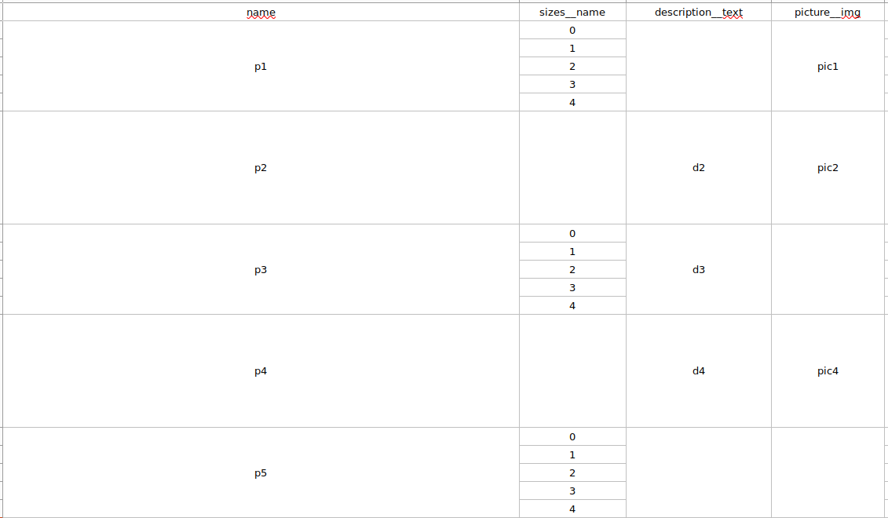

Quick guide:

Here is defined models for example:
```python
from django.db import models


class MyFiles(models.Model):
    file = models.FileField(upload_to='path/to/upload/')
    description = models.TextField()


class M2MRelated(models.Model):
    field = models.TextField()


class RelatedModel:
    field = models.TextField()


class MyModel:
    field = models.TextField()
    related_model = models.ForeignKey(RelatedModel, models.DO_NOTHING)
    m2m_related = models.ManyToManyField(M2MRelated)
```
How to use BaseReport class:
```python
from django_excel_report import BaseReport


class MyReport(BaseReport):
    model = MyModel
    fields = ["field", "related_model__field", "m2m_related__field"]

def some_task(**kwargs):
    qs = MyModel.objects.filter(**kwargs)
    report = MyReport(queryset=qs)
    file = report.get_django_file()
    instance = MyFiles.objects.create(description='description')
    instance.file.save('report.xlsx', file)
```

BaseReport class provides easy way to generate reports with merged cells for related objects:

